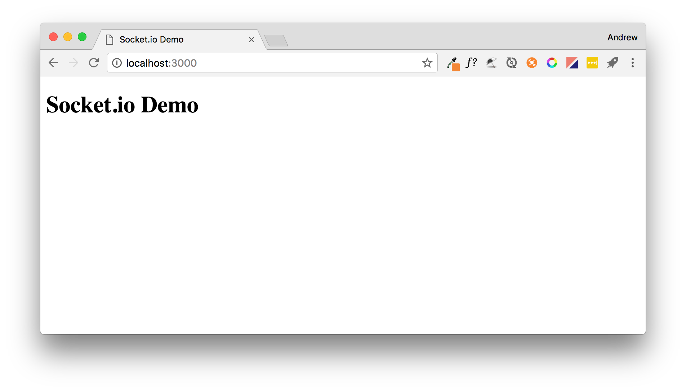
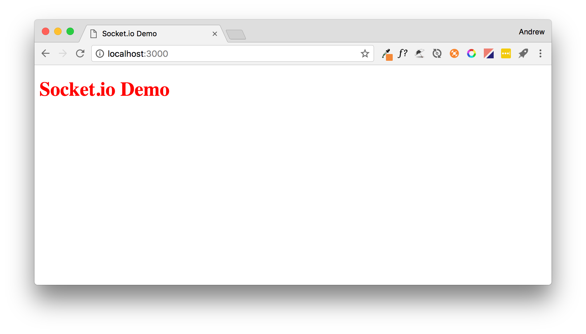
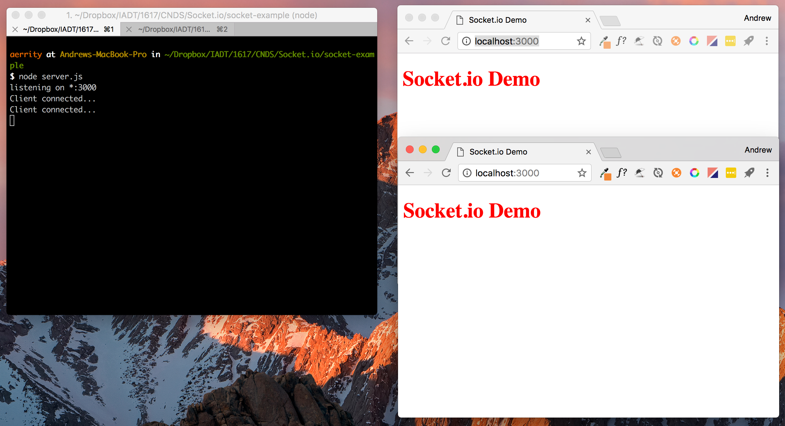
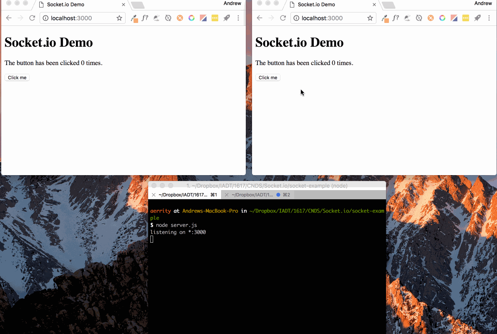

# Getting started with Node, Express and Socket.io

This tutorial will talk you through how to setup a [Node.js](https://nodejs.org/) project and develop a client-server web application using [Express](https://www.expressjs.com) and [Socket.io](https://socket.io).


## Introduction to Node.js

**Node.js** is a JavaScript runtime that allows you to run JavaScript code on the server-side. You can think of it as the JavaScript runtime (e.g. console) from the web browser (e.g. Chrome) ripped out and made available for web servers.

If you haven't already, head along to [https://nodejs.org](https://nodejs.org) and install Node on your machine. (_Note: it's already installed on the lab machines_).

### Running JavaScript code with Node

To test that Node is set-up correctly, open a command line and run the command `node`. This will open Node's [REPL](https://en.wikipedia.org/wiki/Read%E2%80%93eval%E2%80%93print_loop) (read evaluate print loop) where you can enter JavaScript commands. Try the entering these commands:

	N:\ node
	> var x = 10;
	undefined
	> var y = 20;
	undefined
	> x + y;
	30
	> .exit
	
Typing all of our JavaScript code in the console like this would obviously not be much fun... So we'll put our code in a file and run it with Node. Create a file named `script.js` and put this code in it:

```js
var x = 10;
var y = 20;
console.log(x + y);
```
	
Then at the command line you can run	`node script.js` which should execute the JavaScript code and print `30`.

# Setting up a Node project

Create a folder to store the project and change directory so you are in the project folder, e.g.

	mkdir socket-example
	cd socket-example
	
Now we will use the **Node Package Manager (NPM)** to intialise our project by running `npm init .`

This will prompt you to enter information about your project such as project name, author, etc. You can press enter to each line to accept the defaults. When prompted to enter the **entry point** type `server.js`. For example:

	name: (socket-example)
	version: (1.0.0)
	description: Demo socket.io project
	entry point: (index.js) server.js
	test command:
	git repository:
	keywords:
	author: Andrew Errity
	license: (ISC)
	About to write to /Users/aerrity/socket-example/package.json:
	
	{
	  "name": "socket-example",
	  "version": "1.0.0",
	  "description": "Demo socket.io project",
	  "main": "server.js",
	  "scripts": {
	    "test": "echo \"Error: no test specified\" && exit 1"
	  },
	  "author": "Andrew Errity",
	  "license": "ISC"
	}

	Is this ok? (yes)
	
This will create a `package.json` file in your project folder. This file contains information about your project and the packages it depends upon. This project is going to use two packages Express and Socket.io. They can be installed by running:

	npm install express --save
	npm install socket.io --save
	
These commands will add entries for each package in `package.json` and also install the packages **and all their dependencies** in a new `node_modules` folder.

## A note on proxy servers

If the above commands fail and you are working from within IADT you may need to configure `npm` to access the Internet via IADT's proxy server. To do this type:

	npm config set proxy http://merlin:8080
	
Should you ever need to unset this, e.g. if you are working on a laptop and want to work at home, you can run:

	npm config delete proxy
	
# Express.js

## Background

[Express](https://www.expressjs.com) is a web application framework for Node. It provides some extra features that make it easy to quickly create a powerful webserver and API.

We already installed it into our project with the command:

	npm install express --save
	
## Webserver set-up

Next, create a file named `server.js` in your project folder. This will contain the code for your web server, i.e. your **server-side** code. Put the code below in `server.js`:

```js
// server.js
var express = require('express');  
var app = express();  
var server = require('http').createServer(app);  
	
//start our web server and socket.io server listening
server.listen(3000, function(){
  console.log('listening on *:3000');
}); 
```
	
This code setups an Express webserver and starts it listening on port 3000. To start the webserver run 

	node server.js
	
You can then visit [http://localhost:3000](http://localhost:3000) in your web browser. The browser will send a GET request for the root folder (/) which will return an error.

	Cannot GET /
	
To fix this we will add a **route**. This will direct GET requests for the root directory (/) to the file `index.html`. Modify `server.js` as follows:

```js
// server.js
var express = require('express');  
var app = express();  
var server = require('http').createServer(app);  
	
//redirect / to our index.html file
app.get('/', function(req, res,next) {  
    res.sendFile(__dirname + '/public/index.html');
});
	
//start our web server and socket.io server listening
server.listen(3000, function(){
  console.log('listening on *:3000');
}); 
```

Create a new folder in your project folder called `public`. This folder will hold all of our **front-end** or **client-side** files, e.g. .html, .css, .js, etc. Create a new file named `index.html` in this folder and edit it to contain the following:

```html
<!DOCTYPE html>
<html>
   <head>
      <title>Socket.io Demo</title>
      <meta charset="utf-8">
   </head>
   <body>
		 <h1>Socket.io Demo</h1>	 
   </body>
</html>
```

Restart your server by pressing CTRL+C on the command line and then running `node server.js` again. Now when you visit [http://localhost:3000](http://localhost:3000) you should be routed to index.html.



If you needed your server to handle more routes you could add them as needed, e.g.

```js
app.get('/users', function(req, res,next) {  
    res.sendFile(__dirname + '/public/users.html');
});
```
	
would route from [http://localhost:3000/users](http://localhost:3000) to the file `public/users.html`.

## Serving static files

Another useful feature of Express is its ability to server static files like images, CSS files and JavaScript files. This can be done using `express.static` as shown in the updated `server.js` below:

```js
// server.js
var express = require('express');  
var app = express();  
var server = require('http').createServer(app);  
	
app.use(express.static(__dirname + '/public')); 
//redirect / to our index.html file
app.get('/', function(req, res,next) {  
    res.sendFile(__dirname + '/public/index.html');
});
	
//start our web server and socket.io server listening
server.listen(3000, function(){
  console.log('listening on *:3000');
});
``` 
	
We can now add a `styles.css` file to our public folder and edit it to contain the following:

```html
h1 {
color: red;
}
```
	
And edit our index.html to load this CSS file:

```html
<!DOCTYPE html>
<html>
   <head>
      <title>Socket.io Demo</title>
      <meta charset="utf-8">
      <link rel="stylesheet" href="styles.css">
   </head>
   <body>
		 <h1>Socket.io Demo</h1>	 
   </body>
</html>
```

This will apply some amazing cutting edge styling, tada!



Now we have a webserver setup we could serve as many webpages as we like and they can include CSS files, JS files, images, etc.

# Socket.io

## Background

[Socket.io](http://socket.io/) is a JavaScript library that provides realtime, bidirectional communciation between web servers and clients. It primarily uses [WebSockets](https://en.wikipedia.org/wiki/WebSocket) as the underlying protocol, but can fallback to simpler polling if WebSockets are not supported by the client/server. It has two parts:

* Client-side library that runs in the browser;
* Server-side library for Node.js.

Documentation can be found on [Socket.io's GitHub](https://github.com/socketio/socket.io/tree/master/docs) and there is also a [cheatsheet](https://gist.github.com/alexpchin/3f257d0bb813e2c8c476) which is useful.

## Adding Socket.io to our project

We previously installed the Socket.io package into our project with the command `npm install socket.io --save`

### Server-side
	
We can add Socket.io to our server code by adding some code to `server.js`. This will make the Socket.io package available via the io variable:

```js
var io = require('socket.io')(server); 
```

This function will run when a new client connects. Socket.io is [event-driven](https://en.wikipedia.org/wiki/Event-driven_programming), so most things are handled via functions that will 'fire' when some particular thing happens, e.g.:

```	js 
//when a client connects, do this
io.on('connection', function(client) {  
    console.log('Client connected...');
});
```

Now the full `server.js` should look like this:

```js
// server.js
var express = require('express');  
var app = express();  
var server = require('http').createServer(app); 
var io = require('socket.io')(server); 

app.use(express.static(__dirname + '/public')); 
//redirect / to our index.html file
app.get('/', function(req, res,next) {  
    res.sendFile(__dirname + '/public/index.html');
});

//when a client connects, do this
io.on('connection', function(client) {  
    console.log('Client connected...');
});

//start our web server and socket.io server listening
server.listen(3000, function(){
  console.log('listening on *:3000');
}); 
```
#### Quick tip

Are you getting annoyed having to go to the command line to stop and restart your node server each time you change `server.js`? Good news! There's a tool called [nodemon](http://nodemon.io/) that will watch for changes to your node application and automatically restart the server. 

You can install it using:

	npm install -g nodemon
	
the `-g` makes it available in all your projects.

Now to run your file use `nodemon server.js` instead of `node server.js`. Time saver!

### Client-side

On the client-side, we can add Socket.io by modifying `index.html`. We need to load the Socket.io client-side JS file:

```html
<script src="/socket.io/socket.io.js"></script>
```

and write some JavaScript to connect to the server:

```html
<script>
	 var socket = io.connect();
</script>
```

so the full `index.html` becomes:

```html
<!DOCTYPE html>
<html>
   <head>
      <title>Socket.io Demo</title>
      <meta charset="utf-8">
		<link rel="stylesheet" href="styles.css">
   </head>
   <body>
		 <h1>Socket.io Demo</h1>	 
		 <p id="text">0 Clients have connecteed</p>
		 <script src="/socket.io/socket.io.js"></script>
		 <script>
			 var socket = io.connect();
		</script>
   </body>
</html>
```

Now each time we load [http://localhost:3000](http://localhost:3000), the client connects to our server, and the server logs the connection.



## Sending and receiving messages

Two key Socket.io functions are: 

* **.emit** Sends messages between server-client(s).
* **.on** Handles incoming messages.

To demonstrate this we will modify our client and server. Start by adding a `<p>` tag and `<button>` to the client. We will also add a function to handle button clicks. This function will **emit** a 'clicked' message to the server each time the button is clicked. We will also add an **on** message handler to deal with incoming 'buttonUpdate' messages from the server (more on this in a shortly).

```html
<!DOCTYPE html>
<html>
   <head>
      <title>Socket.io Demo</title>
      <meta charset="utf-8">
		<link rel="stylesheet" href="styles.css">
   </head>
   <body>
		 <h1>Socket.io Demo</h1>	 
		 <p id="buttonCount">The button has been clicked 0 times.</p>
		 <button onclick="buttonClicked()">Click me</button>
		 <script src="/socket.io/socket.io.js"></script>
		 <script>
			 var socket = io.connect();
			 
			 function buttonClicked(){
			   socket.emit('clicked');
			 }
			 
			 //when we receive buttonUpdate, do this
			 socket.on('buttonUpdate', function(data){
				 document.getElementById("buttonCount").innerHTML = 'The button has been clicked ' + data + ' times.';
			 });
		</script>
   </body>
</html>
```

In `server.js` we add a variable `var clickCount = 0;` to keep track of how many times clients have clicked the button. This will be one variable keeping track of all the client clicks. We will then add a function:

```js
client.on('clicked', function(data) {
	  clickCount++;
	  //send a message to ALL connected clients
	  io.emit('buttonUpdate', clickCount);
});
```

that handles 'clicked' messages that come in from the client. When the server receives one of these messages it increments the `clickCount` variable and **emits** a 'buttonUpdate' message to all clients. 

This message contains the clickCount variable, which will be received by the **client-side** function we have already added to `index.html`:

```js
socket.on('buttonUpdate', function(data){
	document.getElementById("buttonCount").innerHTML = 'The button has been clicked ' + data + ' times.';
});
```
			 
This is used to update the contents of the `<p>` tag.

The entire `server.js` now looks like:

```js
// server.js
var express = require('express');  
var app = express();  
var server = require('http').createServer(app); 
var io = require('socket.io')(server); 

//keep track of how times clients have clicked the button
var clickCount = 0;

app.use(express.static(__dirname + '/public')); 
//redirect / to our index.html file
app.get('/', function(req, res,next) {  
    res.sendFile(__dirname + '/public/index.html');
});

io.on('connection', function(client) { 
	console.log('Client connected...'); 
	//when the server receives clicked message, do this
    client.on('clicked', function(data) {
    	  clickCount++;
		  //send a message to ALL connected clients
		  io.emit('buttonUpdate', clickCount);
    });
});

//start our web server and socket.io server listening
server.listen(3000, function(){
  console.log('listening on *:3000');
}); 
```

Putting this all together should produce the following!



# Taking this a step further

Can you modify this example so that there is a text input field in the client, and when a user types a message in the input field and clicks a 'send' button the text they typed in is sent to all the other connected clients and displayed on the webpage? This is the first step towards a chat app.
